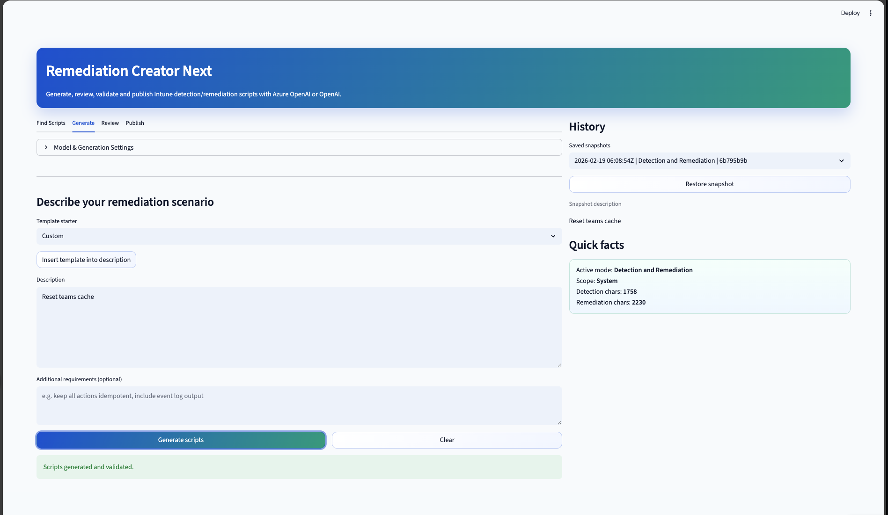
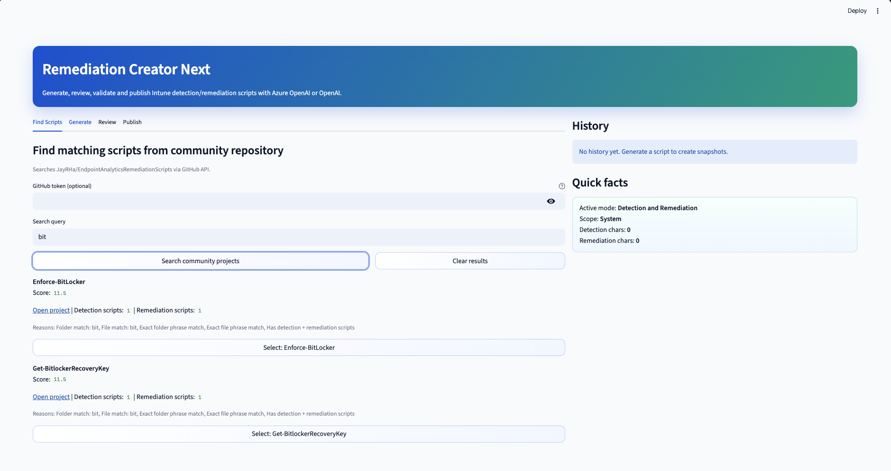
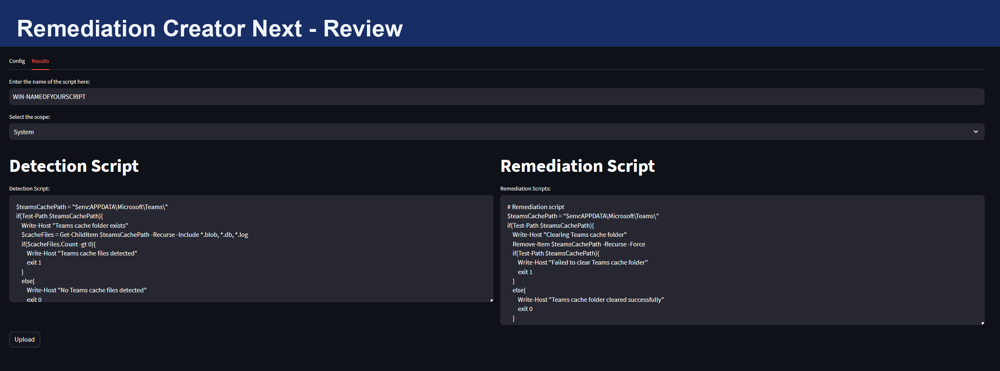
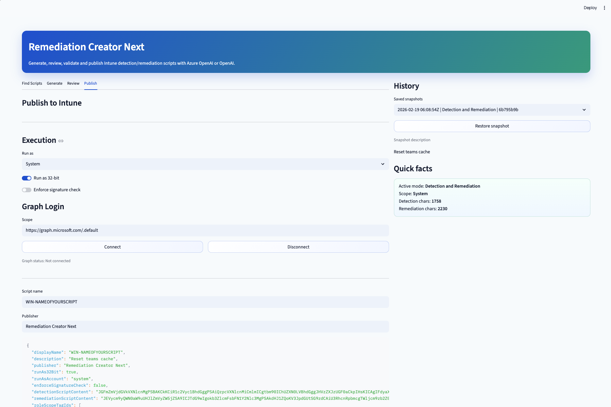

# Remediation Creator Next

Modern Streamlit app to generate, review, and publish Microsoft Intune Endpoint Analytics detection and remediation scripts.



## Why this project

Creating Intune remediation scripts manually is slow and repetitive.
This app helps you:

- draft detection and remediation PowerShell scripts with LLM support
- validate scripts before upload
- search an existing community script catalog and reuse good patterns
- publish directly to Intune via Microsoft Graph payload

## Current UI flow

Tabs in the app:

1. `Find Scripts`
2. `Generate`
3. `Review`
4. `Publish`

## UI screenshots

### Find Scripts



### Generate


### Review



### Publish



### `Find Scripts`

- Searches `JayRHa/EndpointAnalyticsRemediationScripts` via GitHub API
- Shows scored matches (folder + file relevance)
- `Select` saves a project for review

### `Generate`

- Collapsible **Model & Generation Settings** block:
  - Provider (`Azure OpenAI` or `OpenAI`)
  - Preset / custom model
  - Mode (`Detection only` or `Detection and Remediation`)
  - Temperature and max tokens
- Description and optional extra requirements
- Script generation

### `Review`

- Shows selected community project preview (if selected in `Find Scripts`)
- `Use selected scripts in editor` to copy community scripts into review editors
- Built-in validation hints and export as `.ps1`

### `Publish`

- Intune payload preview
- Graph auth connect/disconnect
- Upload to device health scripts endpoint

## Key features

- Azure OpenAI and OpenAI provider support
- GPT-5 model support with automatic Responses API routing
- Automatic fallback for models that only allow default temperature
- Community script discovery with selection flow into review
- Script validation (exit code checks, risky command hints)
- Download support for `detection.ps1`, `remediation.ps1`, and `payload.json`

## Tech stack

- `streamlit==1.54.0`
- `azure-identity==1.25.2`
- `openai==2.21.0`
- `requests==2.32.5`

## Quick start (recommended)

Because many macOS Python installs are "externally managed" (PEP 668), use a virtual environment:

```bash
cd /path/to/Remediation-Creator
python3 -m venv .venv
source .venv/bin/activate
python -m pip install --upgrade pip
python -m pip install -r requirements.txt
```

Create secrets file:

```bash
cp .streamlit/secrets.toml.example .streamlit/secrets.toml
```

Run app:

```bash
python -m streamlit run app.py
```

Open:

```text
http://localhost:8501
```

## Configuration

`Model / deployment` in UI is primary.
`secrets.toml` values are fallback only.

Example `.streamlit/secrets.toml`:

```toml
AZURE_OPENAI_KEY = "..."
AZURE_OPENAI_ENDPOINT = "https://YOUR-ENDPOINT.cognitiveservices.azure.com"
AZURE_OPENAI_CHATGPT_DEPLOYMENT = "gpt-5.2-chat" # fallback
AZURE_OPENAI_API_VERSION = "2025-04-01-preview"

OPENAI_API_KEY = "" # optional
OPENAI_MODEL = "gpt-5.2-chat" # fallback

APP_REGISTRATION_ID = "..."
GRAPH_SCOPE = "https://graph.microsoft.com/.default"
```

## Model notes

- For `gpt-5*` models, the app prefers the Responses API automatically.
- If a model rejects non-default temperature, the app retries without custom temperature.
- If UI model field is set, it overrides fallback values from TOML.

## Community select workflow

1. Open `Find Scripts`
2. Search for topic (example: `bitlocker`)
3. Click `Select` on a result
4. Open `Review`
5. Click `Use selected scripts in editor` (optional)

## Security and operations

- Never commit real secrets (`.streamlit/secrets.toml` is gitignored)
- Rotate keys if exposed
- Review all generated scripts before production use

## Troubleshooting

### `No module named streamlit`

Use venv and install requirements:

```bash
source .venv/bin/activate
python -m pip install -r requirements.txt
```

### `externally-managed-environment`

Do not install globally with Homebrew Python. Use `.venv`.

### `Unsupported value: temperature`

Handled automatically in current app versions; update to latest code if you still see it.

### `DeploymentNotFound`

Your model/deployment name does not exist on that Azure resource.
Check your deployment name in Azure and set it in UI `Model / deployment`.

## Project structure

```text
app.py
modules/
  community_search.py
  prompts.py
  utility.py
.streamlit/
  config.toml
  secrets.toml.example
requirements.txt
run.sh
run.ps1
```

## License

Apache 2.0
